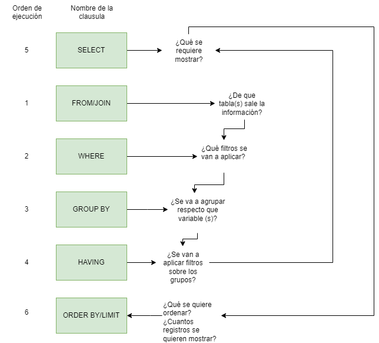

# SQL Tutorial-TRAINING

Este repositorio alberga un desafío de 40 días dedicado a la práctica de SQL, inspirado en la serie de videos de [DiscoDurodeRoer](https://github.com/DiscoDurodeRoer). Mi objetivo principal es actualizar las consultas para que sean compatibles con las versiones actuales del motor de base de datos objetivo. Además, planeo agregar nuevas consultas alternativas, ya sea propuestas por mí o recopiladas de los usuarios de YouTube. Esto incluirá la corrección de errores y la introducción de enfoques alternativos. También me deseo explicar conceptos clave relevantes para la ejecución efectiva de estas consultas.

Por último, deseo destacar el excelente trabajo realizado por [DiscoDurodeRoer](https://github.com/DiscoDurodeRoer), quien es el autor de todas  las consultas principales y el esquema de la base de datos.

Muy bien , comenzamos :) 

SQL en 6 preguntas.A modo de repaso o introducción expongo mi forma de pensar el orden de las consultas en SQL:

